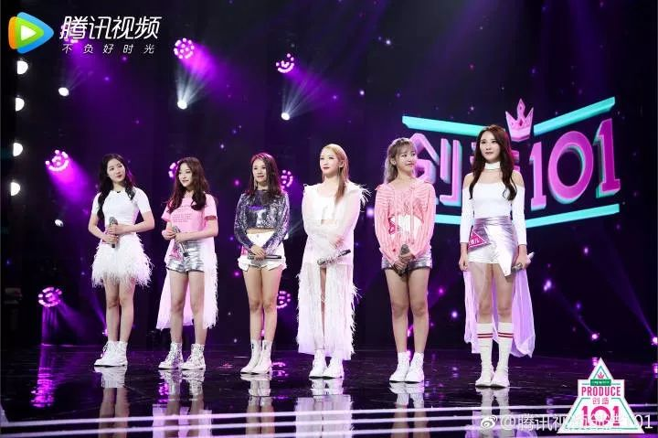

## 你做的很好，但是没用

> 发布日期：2018-05-09

作为一个严肃的中年人，我极少关注综艺节目。直到最近腾讯视频出了一个美少女选秀节目：《创造101》。101个妙龄姑娘，为了争夺最后能出道的11个席位，台下玩命训练，台上拼尽全力。

节目之所以好看，是因为拍出了女孩子们的焦虑。我一边看，一边也跟着一起焦虑：我喜欢的那个妹子，能不能从101人里脱颖而出，成功出道？出道之后，能不能站C位，而不是仅仅做个陪衬？（C位就是跳舞时最中间的位子，这个词我也是新学的）站了C位，能不能火？如果火了，能火多久？

为此，我还专门请教了我的好朋友，知名歌手P君。P君反问我：“你能说出几个最近几年内火起来的明星？”我想了半天，也没叫出几个名字。P君总结道：“就是嘛。做明星太难了，会唱、会演的人太多，但是观众一年也记不住几个新名字，竞争太激烈。”

所以做明星真的好难啊！每年成千上万的新人，只为了抢观众心中屈指可数的那几个位子。这种竞争，可谓地狱模式。

这让我想起，2009年我从南京大学毕业，拿到了腾讯的offer。我当时觉得自己超厉害，洋洋得意，沾沾自喜，还给学弟学妹们分享面试经验。直到开始新员工培训，我才被震惊了：腾讯那年招了上百个毕业生，清华北大、交大复旦比比皆是。2013年我从腾讯离职，4年间没有过任何升职，连实习生也没带过。因为身边强人实在太多了，轮不到我。而那些当年offer没我好，毕业加入中小公司的同学，很多已经成为自己公司的技术骨干。

去年南京大学给我发了个聘书，让我做“职业生涯规划导师”。我给学弟学妹们的第一条经验，就是“去大公司要谨慎”。如果非要去，不仅要选项目，也要判断项目组里的“竞争环境”怎么样。虽然听起来很功利，但也很实用。

2013年，我和几个腾讯同事离职创业，做了一款很成功的手机游戏。很长一段时间，我把成功的部分原因归结为移动互联网的“用户红利”。后来我才渐渐明白，成绩好，是因为当时腾讯网易还没有全面发力，让我们在竞争中得以暂时领先。今天如果把产品做到足够领先，比如“吃鸡”，“第五人格”，照样可以极低成本获得海量用户。只不过，今天要做到领先，比5年前难多了。

所以这个世界上根本就不存在什么“用户红利”，而只存在“竞争红利”。当市场够大，竞争对手又不多或者不强的时候，就是“竞争红利”出现的时候。如果要创业，就应该选这样的市场。

创业如此，生活亦如此。如果想要生活压力小，那就不该选择一线城市。在昆山月入2万，比在上海月入2万，购买力要强得多。因为房产、餐厅、出租车这些重要支出的价格，都由城市内部的竞争决定。所以购买力不取决于你的“收入”，而取决于你在这个城市里的“收入排名”。

生活如此，谈恋爱亦如此。根据我对我司毕业生的朋友圈的观察，我发现：如果要比谁的女朋友好看，那文科院校的男毕业生要远强于理工科院校。因为文科院校女生多男生少，竞争环境对男生极为有利，而理工科院校则反之。所以，如果有大龄女青年找我介绍男朋友，我的建议都是：去读个商学院吧！

