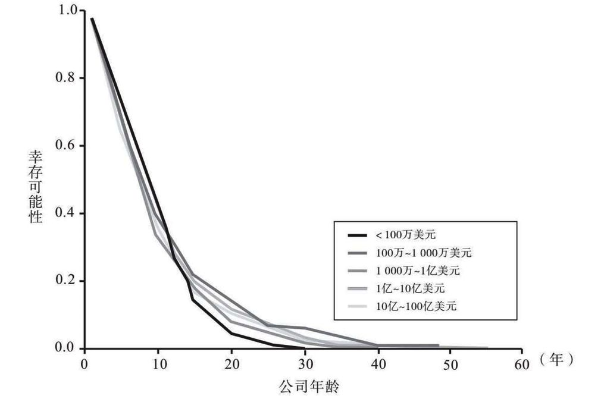

## 何苦做公司

> 发布日期：2018-08-30

因为最近的事件，滴滴正在经历公司成立以来的的“至暗时刻”。我在朋友圈看到很多朋友愤怒地删掉了滴滴APP。对于这样的行为，我颇不能理解。滴滴当然做的还不够好。可我只记得没有滴滴的时候，黑车、拒载、乱要价、故意开错路的情况更多。一个有滴滴的世界，比一个没有滴滴的世界，美好太多了。

有好心的朋友专门给我留言，提醒我不要说滴滴的事件，说得不好会掉粉。我回复说掉粉就掉粉吧，我又不是蛾子，那么怕掉粉干嘛。

最近腾讯的股价掉了1000多亿美金，腾讯也正在承受很久没经历过的批评。有人说腾讯“投行化”，也有人说腾讯“过度投资削弱产品力”。可我只记得大半年前乌镇大会的时候，几乎还是同一拨人，说腾讯“朋友多”、“去中心化赋能”、“控制欲弱”、“战略布局深远”。大半年过去了，腾讯其实还是那个腾讯，微信还是一样好用，跟股价无关，跟我们怎么批评腾讯无关。

作家、导演、音乐人，只要有一两部好作品，他们的好就会被一直记着。而做公司的人就不一样了。做的不好要被骂，做的不如以前好也要被骂。当然，如果一不小心把公司做挂了，那肯定是要被骂到体无完肤了。

所以做公司的人，总的来说是很悲惨的。难怪马云几年前接受采访的时候说：“中国的企业家确实没有好的下场，事实也是，历史也是。”

---

大部分公司的寿命是很短的，而这点常常被我们忽略。根据美国《财富》杂志报道，美国中小企业的寿命不足7年。而中国的中小企业，平均寿命只有2.5年。

我们也常会有一种错觉，觉得公司上市后就可以基业长青。《规模》的作者杰弗里·韦斯特做了一个研究，分析了美国1950年以来的2万多家上市公司，并为他们绘制了一组“死亡曲线”。只有不足5%的公司存活超过30年，而到50年的时候，死亡率几乎是100%。

杰弗里在书中做了一个巧妙的比喻：公司就好像一个人、一个生命一样，会在新陈代谢和维护成本之间保持着精妙的动态平衡。而生命会衰老、会逐渐积累不可修复的损伤，让生命不再有韧性，更容易受到外界波动和危机的影响。当公司老到一定程度，一个小感冒就会让公司死亡。

从长期来看，外界危机的影响不可避免。做自行车做得好好的公司，怎么也不会想到杀出来个共享单车，搞得所有人都不买自行车了。做方便面的也想不到会出来个美团外卖，做广播台的也想不到会被滴滴打车跨界打劫。腾讯也想不到会不发游戏版号，大几千万的用户没法变现。对大量中小游戏公司来说，如果持续不发版号，无法发行新游戏，那死亡率就会大大提升。

世界上最古老的企业据说是日本的“金刚组”，公元578年在大阪成立，是一个家族企业建筑公司。这家公司擅长盖寺庙，可是二战后日本对佛寺的需求逐渐减少，于是在2006年这家公司破产了。吉尼斯记录里面最古老的酒店在日本早川，创立于公元705年，由同一家族的人经营了一千多年。之所以能做这么久，是因为这个酒店里有个天然温泉。

8年前我大学毕业找工作的时候，人人最想去的公司是咨询公司、宝洁、IBM、四大。这些公司，我大部分简历被刷，最好成绩是进入了KPMG的笔试环节。BAT里面，最牛的是能进百度，最差的是进阿里。而如今，外企已经逐渐式微，而阿里则是不知道比百度强到哪里去了。世界变化太快，而未来的公司，只会变得更快，也死的更快。

---

既然死亡是不可避免，到底有没有什么办法，能让企业活得稍微久一点？想了很久，还是有办法。那就是：以一个企业的名义，做多个企业的事情。说白了，就是给企业多找几条命。这条命死了，还有另外一条。

马云说，阿里巴巴要做102年。这个目标极难。不过从马云的做法来看，他还是在向着这个目标在努力的：淘宝之后，又做了蚂蚁、菜鸟、阿里云。据说在蚂蚁之后，菜鸟、阿里云也会成为千亿美金级的公司。

什么时候开始给企业找一条新的命？应该在原有主营业务特别好的时候就开始。因为等到业务不好的时候才开始，就相当于进入了一个时间有限的创业通道，往往已经来不及。说白了，想要企业活得久，就是要持续创业，且持续创业成功。然而，持续创业成功何其困难。因为大部分的成功，只不过是运气罢了。

上周在湖畔大学上课，老师发问：“怎样才能让公司有穿越周期的能力？”我答：死亡是公司的宿命，穿越周期只是自私的奢望。一个美好的社会，不需要哪家公司有穿越周期的能力，就好像我们现在不再需要宝洁、IBM、百度了一样。在合适的时候接受死亡，是每个人每个公司该有的觉悟。只要我们做过的公司，曾经灿烂过，曾经让这个世界变得美好了一些，足矣。

